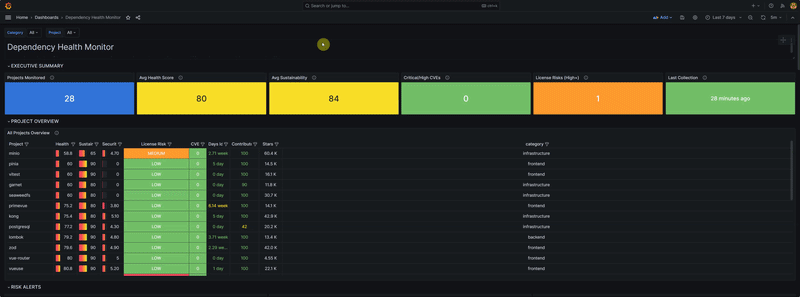

# Dep Watch



Monitors open-source dependencies for license changes, security vulnerabilities, maintenance activity, and sustainability risk. Runs as 3 Docker containers (Collector + Prometheus + Grafana).

## Quick Start

```bash
# 1. Configure credentials
cp .env.example .env
# Edit .env — add your GITHUB_TOKEN (required for 25+ projects)

# 2. Start
docker compose up -d

# 3. Open dashboard
# http://localhost:3001  (admin / admin123)
```

First collection starts automatically and takes ~2 minutes for 27 projects.

### macOS

Docker Desktop for macOS doesn't support `network_mode: host`. Use the override file:

```bash
docker compose -f docker-compose.yml -f docker-compose.mac.yml up -d
```

## Adding/Removing Dependencies

Edit `collector/projects.yml`:

```yaml
projects:
  # Minimal — only github is required
  redis:
    github: redis/redis
    category: infrastructure

  # Full — all fields
  vue:
    github: vuejs/core                    # owner/repo
    libraries_io: npm/vue                 # platform/package (for dependents count)
    category: frontend                    # infrastructure | frontend | backend
    ecosystem: npm                        # npm | Maven | Go | pypi (for CVE queries)
    current_version: "3.5.13"             # version you use (for version-specific CVEs)
```

### Fields

| Field | Required | Description |
|-------|----------|-------------|
| `github` | Yes | GitHub `owner/repo` |
| `category` | Yes | `infrastructure`, `frontend`, or `backend` |
| `libraries_io` | No | `platform/package` for Libraries.io dependents count |
| `ecosystem` | No | Package ecosystem for OSV.dev vulnerability queries |
| `current_version` | No | Your version — enables version-specific CVE detection |

### Known Licenses

If GitHub doesn't detect the license correctly, add it to `known_licenses`:

```yaml
known_licenses:
  owner/repo:
    license: BSD-3-Clause
    risk: 0          # 0=low, 1=medium, 2=high
    risk_label: low
    note: Optional note
```

After editing, either restart the collector or reload without restart:

```bash
curl -X POST http://localhost:8000/reload
```

## Environment Variables

| Variable | Required | Default | Description |
|----------|----------|---------|-------------|
| `GITHUB_TOKEN` | Yes* | — | GitHub personal access token (no scopes needed). [Create one](https://github.com/settings/tokens) |
| `LIBRARIES_IO_KEY` | No | — | Libraries.io API key. [Get one](https://libraries.io/api) |
| `COLLECT_INTERVAL` | No | `86400` | Seconds between collections (default: 24h) |
| `GRAFANA_PASSWORD` | No | `admin123` | Grafana admin password |
| `LOG_LEVEL` | No | `INFO` | `DEBUG`, `INFO`, `WARNING`, `ERROR` |
| `RATE_LIMIT_SECONDS` | No | `30` | Cooldown between manual `/collect` or `/reload` calls |

*Required if monitoring 25+ projects (GitHub rate limit is 60 req/hr without token, 5000 with).

## API Endpoints

| Endpoint | Method | Description |
|----------|--------|-------------|
| `/projects` | GET | List all monitored projects |
| `/risks` | GET | Projects sorted by risk level |
| `/metrics` | GET | Prometheus metrics (scraped automatically) |
| `/collect` | POST | Trigger immediate collection |
| `/reload` | POST | Reload `projects.yml` without restart |

## Project Structure

```
infra-monitor/
├── docker-compose.yml            # Linux (network_mode: host)
├── docker-compose.mac.yml        # macOS override (bridge networking)
├── .env.example
├── collector/
│   ├── main.py                   # FastAPI routes + collection loop
│   ├── collector.py              # API calls with retry/backoff
│   ├── scoring.py                # Health + sustainability scoring
│   ├── metrics.py                # Prometheus metric definitions
│   ├── projects.yml              # Dependencies to monitor
│   ├── requirements.txt
│   ├── Dockerfile
│   └── tests/
│       ├── test_scoring.py       # 33 tests
│       ├── test_config.py        # 15 tests
│       └── test_collector.py     # 5 tests
├── prometheus/
│   ├── prometheus.yml            # Scrape config (Linux)
│   ├── prometheus.mac.yml        # Scrape config (macOS)
│   ├── alerts.yml                # 11 alert rules
│   └── Dockerfile
└── grafana/
    ├── dashboards/
    │   └── infra-health.json     # Main dashboard
    ├── provisioning/
    │   ├── dashboards/dashboard.yml
    │   └── datasources/
    │       ├── datasource.yml        # Linux
    │       └── datasource.mac.yml    # macOS
    └── Dockerfile
```

## Troubleshooting

**No data in Grafana?**
```bash
# Trigger a manual collection
curl -X POST http://localhost:8000/collect

# Check collector logs
docker compose logs collector
```

**Build stuck on pip install?**

DNS issue inside Docker. Build with host networking:
```bash
docker build --network=host -t infra-monitor-collector ./collector
docker compose up -d
```

**Rate limited by GitHub?**

Add a token to `.env`. A personal access token with no scopes gives you 5000 req/hr.

**Scorecard 404 for some projects?**

Normal. Not all projects are indexed by OpenSSF Scorecard. The collector logs a warning and continues with a lower health score.

## Alerts

Prometheus evaluates 11 alert rules every 60 seconds. View active alerts at http://localhost:9090/alerts.

| Alert | Expression | Severity | What it detects |
|-------|-----------|----------|-----------------|
| `LicenseChanged` | `dep_license_changed == 1` | critical | License changed since monitoring started |
| `HighRiskLicense` | `dep_license_risk == 2` | warning | Non-OSI license (BSL, SSPL, Elastic) |
| `CriticalVulnerabilities` | `dep_vulnerabilities{severity="critical"} > 0` | critical | Critical CVEs detected |
| `LowSecurityScore` | `dep_security_score < 4` | warning | OpenSSF Scorecard below 4/10 |
| `LowHealthScore` | `dep_health_score < 50` | warning | Health score below 50/100 |
| `LowSustainabilityScore` | `dep_sustainability_score < 40` | warning | High risk of abandonment |
| `ProjectArchived` | `dep_is_archived == 1` | critical | Repository archived on GitHub |
| `ProjectInactive` | `dep_days_since_commit > 180` | warning | No commits in 6+ months |
| `SingleMaintainer` | `dep_contributors <= 1` | warning | Bus factor of 1 person |
| `CollectionStale` | `(time() - collector_last_run_timestamp) > 172800` | warning | Collector hasn't run in 48h |
| `CollectionErrors` | `increase(collector_errors_total[24h]) > 5` | warning | More than 5 collection errors in 24h |

### Sending Notifications

By default alerts are visible in the Prometheus UI but not sent anywhere. To receive notifications, add an [Alertmanager](https://prometheus.io/docs/alerting/latest/alertmanager/) container.

**1. Create `alertmanager/alertmanager.yml`:**

For **email**:

```yaml
global:
  smtp_smarthost: 'smtp.gmail.com:587'
  smtp_from: 'alerts@yourcompany.com'
  smtp_auth_username: 'alerts@yourcompany.com'
  smtp_auth_password: 'app-password-here'

route:
  receiver: email
  group_wait: 30s
  group_interval: 5m
  repeat_interval: 4h

receivers:
  - name: email
    email_configs:
      - to: 'team@yourcompany.com'
        send_resolved: true
```

For **Microsoft Teams** (via webhook):

```yaml
route:
  receiver: teams
  group_wait: 30s
  group_interval: 5m
  repeat_interval: 4h

receivers:
  - name: teams
    webhook_configs:
      - url: 'https://your-org.webhook.office.com/webhookb2/xxxx/IncomingWebhook/xxxx'
        send_resolved: true
```

For **both**:

```yaml
global:
  smtp_smarthost: 'smtp.gmail.com:587'
  smtp_from: 'alerts@yourcompany.com'
  smtp_auth_username: 'alerts@yourcompany.com'
  smtp_auth_password: 'app-password-here'

route:
  receiver: email
  group_wait: 30s
  group_interval: 5m
  repeat_interval: 4h
  routes:
    - match:
        severity: critical
      receiver: teams

receivers:
  - name: email
    email_configs:
      - to: 'team@yourcompany.com'
        send_resolved: true
  - name: teams
    webhook_configs:
      - url: 'https://your-org.webhook.office.com/webhookb2/xxxx/IncomingWebhook/xxxx'
        send_resolved: true
```

**2. Add alertmanager to `docker-compose.yml`:**

```yaml
  alertmanager:
    image: prom/alertmanager:v0.26.0
    container_name: infra-alertmanager
    network_mode: host
    volumes:
      - ./alertmanager/alertmanager.yml:/etc/alertmanager/alertmanager.yml:ro
    command:
      - '--config.file=/etc/alertmanager/alertmanager.yml'
      - '--web.listen-address=:9093'
    restart: unless-stopped
```

**3. Point Prometheus to it in `prometheus/prometheus.yml`:**

```yaml
alerting:
  alertmanagers:
    - static_configs:
        - targets: ['localhost:9093']
```

Restart everything and alerts will flow to your channels.

## Running Tests

```bash
pip install pytest pytest-asyncio
pytest collector/tests/ -v
```

## License

MIT
